<p align="center">
  
</p>

Notlar sıradan `.md` dosyaları olarak diskte durur. Uygulamayı silsen de notların
okunabilir kalır; Obsidian, VS Code ya da herhangi bir metin düzenleyiciyle açılabilir.

- **macOS:** saf AppKit, bağımlılık yok
- **Linux:** GTK 4 (Ubuntu 22.04'te denendi)
- **Dil:** Swift 5.9, SwiftPM

---

## Özellikler

<p align="center">
   [!💡 sarı] uyarı kutusuna dönüşür; / blok menüsünü açar.">
</p>

- **Sayfa ağacı.** Her sayfanın altında alt sayfalar olabilir. Sürükle-bırakla taşınır ve sıralanır.
- **Biçimli düzenleme.** Kalın, italik, üstü çizili, satır içi kod, vurgu, başlıklar, listeler,
  yapılacaklar, alıntı, kod bloğu, uyarı kutusu, ayırıcı, görsel.
- **`/` blok menüsü.** Satır başında `/` yazınca blok türü seçilir.
- **Sayfa bağları.** `[[Sayfa adı]]` yazınca diğer sayfaya bağ kurulur. Sayfa taşınıp
  adlandırılınca bağlar kendiliğinden güncellenir. Her sayfanın altında ona bağ veren sayfalar listelenir.
- **İçindekiler.** Sağ kenarda başlıklardan oluşan yüzen bir panel. Okuduğun bölüm vurgulanır,
  tıklayınca o başlığa gider.
- **Hızlı sayfa bulucu** (`⌘P` / `Ctrl+P`): Türkçe karakterlere duyarsız arama
  ("istanbul" yazınca "İstanbul" da bulunur).
- **Ana Sayfa.** Son açılan sayfalar, tüm notlardaki bekleyen yapılacaklar, hızlı eylemler
  (yeni sayfa, günlük not, şablondan sayfa).
- **Otomatik kayıt.** Yazmayı bıraktıktan 5 sn sonra kaydeder; kapatırken de kaydeder.
- **Sayfa geçmişi.** Sayfanın eski sürümlerine dönülebilir.
- **Çöp kutusu.** Silinen sayfalar 30 gün boyunca geri yüklenebilir.
- **Dışa aktarma.** PDF, tek dosya HTML ya da Markdown.
- **Katlama.** Başlıkların altındaki bölümler katlanabilir.
- **Kağıt temaları.** Sepya, Yeşilimsi Kağıt, Gri Kağıt, Krem.
- **Pencereyi üstte tutma (📌).** Pencere diğer pencerelerin üstünde kalır.

---

## Kurulum ve Çalıştırma

<p align="center">
  
</p>

### macOS

Gerekenler: macOS 12+, Xcode ya da Xcode Command Line Tools (Swift 5.9+).

```bash
git clone <depo-adresi> NotDefteri
cd NotDefteri
swift run
```

Ya da yardımcı betikle:

```bash
./calistir.sh        # derle (gerekiyorsa) ve aç — uygulama zaten açıksa öne getirir
./calistir.sh -r     # optimize (release) derleme ile aç
./calistir.sh -t     # önce testleri çalıştır, geçerse aç
./calistir.sh -d     # baştan temiz derleme
```

Girişte kendiliğinden açılması için: **Not Defteri menüsü → Girişte Otomatik Başlat**.

### Terminal kısayolu: `not`

Linux'ta `linux-kur.sh` bunu kendisi kurar. macOS'ta bir kez kurduktan sonra terminalde
yalnızca `not` yazınca uygulama açılır (gerekiyorsa önce derlenir):

```bash
./scripts/kisayol-kur.sh
```

| Komut | Ne yapar |
|---|---|
| `not` | Derle (gerekiyorsa) ve aç |
| `not -r` | Optimize (release) derlemeyle aç |
| `not -t` | Önce testleri çalıştır, geçerse aç |
| `not -d` | Baştan temiz derle ve aç |

Kısayol `~/.local/bin/not` dosyasıdır ve bu klasördeki `calistir.sh`'yi çağırır.
`~/.local/bin` PATH'te değilse `~/.zshrc` (macOS) ya da `~/.bashrc` (Linux) dosyasına bir satır eklenir.
Linux'ta `calistir.sh` kendiliğinden `scripts/linux-calistir.sh`'ye geçer.

### Linux (Ubuntu 22.04)

Tek komut. Her şeyi o kurar: GTK 4 paketleri, Swift, derleme, `not` komutu, uygulama menüsü girdisi.
Sonunda uygulamayı açar.

```bash
git clone <depo-adresi> ~/NotDefteri
~/NotDefteri/scripts/linux-kur.sh
```

Bundan sonra terminalde yalnızca:

```bash
not
```

Uygulama menüsünde de **Office → Not Defteri** olarak durur.

Güncellemek için `git pull` yapıp yine `not` yazman yeterli; kod değiştiyse kendisi derler
(ilk kurulumdaki tam derleme birkaç dakika sürer, sonrakiler birkaç saniye).

> **Not:** Pencereyi üstte tutma (📌) Wayland oturumlarında da çalışır (Zorin, Ubuntu GNOME): Wayland bu
> isteği desteklemediği için uygulama XWayland üzerinden açılır. İstemezsen `GDK_BACKEND=wayland not` ile başlat.

---

## Kullanım

### Sayfa oluşturma

- Başlık çubuğundaki **yeni sayfa** düğmesi, seçili sayfanın yanına yeni bir sayfa ekler.
- Kenar panelde sayfaya **sağ tıklayınca**: alt sayfa ekle, yanına sayfa ekle, yeniden adlandır,
  sabitle (📌), sil.
- Yeni sayfanın adı ilk satırdan otomatik alınır; ilk satırı değiştirdikçe ad da değişir.

### Yazarken biçimlendirme

- **Metin seçince** üstünde bir biçim çubuğu çıkar: Kalın, İtalik, Çizili, Kod, Vurgu, Bağlantı.
- **Satır başında `/`** yazınca blok menüsü açılır: Başlık 1/2/3, Madde listesi, Numaralı liste,
  Yapılacak, Alıntı, Kod bloğu, Ayırıcı, Alt sayfa, Görsel, Uyarı kutusu (gri, mavi, sarı,
  kırmızı, yeşil). Yazarak süzülür, `Enter` ile seçilir.
- Kenar paneldeki **B1 / B2 / B3 / Aa** düğmeleri satırı başlığa ya da düz metne çevirir.
  **A− / A+** seçili metnin puntosunu değiştirir.
- Markdown sözdizimi de çalışır: `# `, `- `, `1. `, `- [ ] `, `> `, ` ``` ` vb.

### Sayfalar arası bağ

`[[` yazınca sayfa önerileri çıkar. Seçince `[[Sayfa adı]]` bağı oluşur; tıklayınca o sayfa açılır.
Olmayan bir sayfaya bağ verirsen, tıklayınca sayfayı oluşturmayı önerir.

### Görsel ekleme

Görseli editöre yapıştır ya da sürükle. Dosya sayfanın `Görseller/` klasörüne kopyalanır.
Görselin köşesinden sürükleyerek boyutunu değiştirebilirsin.

### Yapılacaklar

`- [ ] iş` satırları **Ana Sayfa**'da toplanır. Oradan işaretlediğin iş, kendi sayfasında da
tamamlandı olarak işaretlenir.

---

## Klavye Kısayolları

Linux'ta `⌘` yerine `Ctrl`, `⌥` yerine `Alt` kullanılır. Tam liste: **Yardım → Klavye kısayolları** (`⌘/`).

| İşlem | macOS | Linux |
|---|---|---|
| Hızlı sayfa bulucu | `⌘P` | `Ctrl+P` |
| Ana Sayfa | `⇧⌘H` | `Ctrl+Shift+H` |
| Kaydet | `⌘S` | `Ctrl+S` |
| Geri al / Yinele | `⌘Z` / `⌘Y` | `Ctrl+Z` / `Ctrl+Y` |
| Kalın / İtalik | `⌘B` / `⌘I` | `Ctrl+B` / `Ctrl+I` |
| Üstü çizili | `⇧⌘X` | `Ctrl+Shift+X` |
| Satır içi kod | `⌘E` | `Ctrl+E` |
| Vurgu | `⌥⌘H` | `Ctrl+Alt+H` |
| Bağlantı | `⌘K` | `Ctrl+K` |
| Bul / Bul ve değiştir | `⌘F` / `⌥⌘F` | `Ctrl+F` / `Ctrl+Alt+F` |
| Sonrakini bul | `⌘G` | `Ctrl+G` |
| Kaynak biçimiyle yapıştır | `⇧⌘V` | `Ctrl+Shift+V` |
| Önceki / sonraki not | `⌘[` / `⌘]` | `Ctrl+[` / `Ctrl+]` |
| Bölümü katla / aç | `⌥⌘[` / `⌥⌘]` | `Ctrl+Alt+[` / `Ctrl+Alt+]` |
| Tümünü katla / aç | `⇧⌥⌘[` / `⇧⌥⌘]` | `Ctrl+Alt+Shift+[` / `]` |
| Puntoyu büyüt / küçült | `⌘*` / `⌘-` | `Ctrl+*` / `Ctrl+-` |
| Sayfa geçmişi | `⌥⌘Y` | `Ctrl+Alt+Y` |
| PDF olarak dışa aktar | `⇧⌘E` | `Ctrl+Shift+E` |
| Tam ekran | `⌃⌘F` | `F11` |
| Kenar paneli | — | `Ctrl+\` |
| İçindekiler paneli | — | `Ctrl+Shift+\` |
| Çıkış | `⌘Q` | `Ctrl+Q` |

---

## Notlar Nerede Saklanıyor?

Tüm notlar **`~/Documents/NotDefteri/`** klasöründedir. Her sayfa bir klasördür:

```
~/Documents/NotDefteri/
├── Proje/
│   ├── index.md          ← sayfanın içeriği
│   ├── Görseller/        ← sayfaya eklenen görseller
│   └── Toplantı Notları/ ← alt sayfa
│       └── index.md
└── Günlük/
    └── index.md
```

- Dosyalar düz Markdown'dır. Uygulama tanımadığı sözdizimini (tablo, wikilink, frontmatter…)
  biçimli göstermese de **olduğu gibi korur**.
- Markdown'a iki küçük ek vardır: punto için `<punto=16>metin</punto>`, görsel boyutu için
  `{320x240}`.
- Klasörü Git ile yedekleyebilir, Dropbox/iCloud ile eşitleyebilirsin.
- Gizli `.sira.json` dosyaları kenar paneldeki elle sıralamayı, `.cop` klasörü çöp kutusunu tutar.

---

## Sorun Giderme

| Sorun | Çözüm |
|---|---|
| Linux: `not` bulunamadı ya da "Swift bulunamadı" | `~/NotDefteri/scripts/linux-kur.sh` komutunu (yeniden) çalıştır |
| Linux: uygulama açılmıyor ya da çöküyor | Günlüğe bak: `~/.local/state/NotDefteri/` altındaki en yeni `.log` dosyası |
| Linux: ilk açılış çok uzun sürdü | İlk derleme tam derlemedir (birkaç dakika). Sonraki açılışlar ~1,5 sn |
| Uygulama ikinci kez açılmıyor | Tek pencereli çalışır; açıkken tekrar başlatınca mevcut pencere öne gelir |
| Bir not açılmadı ya da kaydedilmedi | Uygulama uyarı gösterir ve kapanmayı engeller. Yazdıkların pencerede durur, kopyalayıp yedekle |

---

## Geliştirme

```bash
swift build          # derle
swift test           # testleri çalıştır
```

| Klasör | İçerik |
|---|---|
| `Sources/NotDefteri/Cekirdek/` | Platformdan bağımsız mantık: Markdown çevirici, sayfa ağacı, kayıt, arama (iki platform ortak) |
| `Sources/NotDefteri/` (diğerleri) | macOS arayüzü (AppKit) |
| `Sources/NotDefteriLinux/` | Linux arayüzü (GTK 4) |
| `Sources/CGtk/` | GTK için C köprüsü |
| `Tests/` | Çekirdek ve macOS testleri |
| `06_Metadata/` | Kod haritası ve mimari kararlar. Kodu okumadan önce buraya bak |

Kod kuralları (Türkçe tanımlayıcılar, katmanlar, yorum tarzı) için `CLAUDE.md` ve
`06_Metadata/Mimari-Kararlar.md` dosyalarına bak.
