<p align="center">
  
</p>

<p align="center">
  <a href="docs/tanitim.mp4"></a>
</p>

---

## Features

Click a card to jump to the section that explains how to use it.

<p align="center">
  <a href="#formatting-as-you-type"></a>
</p>
<p align="center">
  <a href="#to-dos"></a>
  <a href="#adding-images"></a>
</p>
<p align="center">
  <a href="#creating-pages"></a>
  <a href="#where-are-notes-stored"></a>
</p>
<p align="center">
  <a href="#more-features"></a>
</p>

### More features

- **Quick finder** (`⌘P` / `Ctrl+P`): type part of a page name and jump to it. It ignores Turkish letter
  differences (typing “istanbul” also finds “İstanbul”).
- **Home page.** Recently opened pages, your open tasks, and one-click new page, daily note or template.
- **Page links.** Type `[[` to get page suggestions and jump to the chosen page in one click.
  Links update themselves when a page is moved or renamed.
- **Block menu.** Type `/` at the start of a line for headings, lists, quotes, callouts and more.
- **Table of contents.** Long pages get a heading list on the right edge; the section you are reading
  is highlighted, and clicking a heading jumps to it.
- **Autosave.** Saves 5&nbsp;seconds after you stop typing, and again when you close the app.
- **Page history.** Go back to an earlier version of a page.
- **Trash.** Deleted pages can be restored for 30&nbsp;days.
- **Export.** Save a page as PDF, a web page or plain text.
- **Section folding.** Fold the content under a heading to tidy up long pages.
- **Paper themes.** Sepia, Greenish Paper, Gray Paper, Cream.
- **Keep on top.** The pin button keeps the window above other windows.

## Installation

<p align="center">
  
</p>

**Quick install (macOS).** Copy the commands and paste them into the terminal:

```bash
git clone https://github.com/olcayalkan/NotDefteri.git
cd NotDefteri
./scripts/kisayol-kur.sh
not
```

For Linux, see the [Linux](#linux-ubuntu-2204) section below.

### macOS

Requirements: macOS 12+, Xcode or the Xcode Command Line Tools (Swift 5.9+).

```bash
git clone https://github.com/olcayalkan/NotDefteri.git NotDefteri
cd NotDefteri
swift run
```

Or use the helper script:

```bash
./calistir.sh        # build (if needed) and open — brings the app to the front if it is already open
./calistir.sh -r     # open with an optimized (release) build
./calistir.sh -t     # run the tests first, open only if they pass
./calistir.sh -d     # clean build from scratch
```

To open the app automatically at login: **Not Defteri menu → Girişte Otomatik Başlat** (Launch at login).

### Terminal shortcut: `not`

On Linux, `linux-kur.sh` sets this up for you. On macOS, install it once; after that, typing `not`
in the terminal opens the app (building it first if needed):

```bash
./scripts/kisayol-kur.sh
```

| Command | What it does |
|---|---|
| `not` | Build (if needed) and open |
| `not -r` | Open with an optimized (release) build |
| `not -t` | Run the tests first, open only if they pass |
| `not -d` | Clean build from scratch and open |

The shortcut is the file `~/.local/bin/not`, and it calls `calistir.sh` in this folder.
If `~/.local/bin` is not on your PATH, a line is added to `~/.zshrc` (macOS) or `~/.bashrc` (Linux).
On Linux, `calistir.sh` hands over to `scripts/linux-calistir.sh` automatically.

### Linux (Ubuntu 22.04)

One command installs everything: the GTK 4 packages, Swift, the build, the `not` command and an
app menu entry. It opens the app when it is done.

```bash
git clone https://github.com/olcayalkan/NotDefteri.git ~/NotDefteri
~/NotDefteri/scripts/linux-kur.sh
```

After that, just type this in the terminal:

```bash
not
```

The app also appears in the app menu under **Office → Not Defteri**.

To update, run `git pull` and type `not` again; it rebuilds itself if the code changed
(the first full build takes a few minutes, later ones a few seconds).

> **Note:** Keep on top (📌) also works in Wayland sessions (Zorin, Ubuntu GNOME). Wayland does not
> support this request, so the app opens through XWayland. To avoid that, start it with `GDK_BACKEND=wayland not`.

---

## Usage

The app's interface is currently in Turkish. Where this guide names a menu or button, the Turkish
label is shown alongside the English one.

### Creating pages

- The **new page** button in the title bar adds a page next to the selected one.
- **Right-click** a page in the sidebar to add a sub-page, add a page next to it, rename it,
  pin it (📌) or delete it.
- A new page takes its name from its first line; the name changes as you edit that line.

### Formatting as you type

- **Select text** to get a formatting bar above it: bold, italic, strikethrough, code, highlight, link.
- **Type `/` at the start of a line** to open the block menu: heading 1/2/3, bulleted list, numbered list,
  to-do, quote, code block, divider, sub-page, image, callout (gray, blue, yellow, red, green).
  Type to filter, press `Enter` to choose.
- The **B1 / B2 / B3 / Aa** buttons in the sidebar turn a line into a heading or back into plain text.
  **A− / A+** change the font size of the selected text.
- Markdown syntax works too: `# `, `- `, `1. `, `- [ ] `, `> `, ` ``` ` and so on.

### Linking pages

Type `[[` to get page suggestions. Choosing one creates a `[[Page name]]` link; clicking it opens that page.
If you link to a page that does not exist yet, clicking the link offers to create it.

### Adding images

Paste or drag an image into the editor. The file is copied into the page's `Görseller/` (images) folder.
Drag the image's corner to resize it.

### To-dos

`- [ ] task` lines are collected on the **Home page**. A task you check off there is also checked off
on its own page.

---

## Keyboard shortcuts

On Linux, use `Ctrl` instead of `⌘` and `Alt` instead of `⌥`. Full list: **Yardım → Klavye kısayolları**
(Help → Keyboard shortcuts, `⌘/`).

| Action | macOS | Linux |
|---|---|---|
| Quick finder | `⌘P` | `Ctrl+P` |
| Home page | `⇧⌘H` | `Ctrl+Shift+H` |
| Save | `⌘S` | `Ctrl+S` |
| Undo / Redo | `⌘Z` / `⌘Y` | `Ctrl+Z` / `Ctrl+Y` |
| Bold / Italic | `⌘B` / `⌘I` | `Ctrl+B` / `Ctrl+I` |
| Strikethrough | `⇧⌘X` | `Ctrl+Shift+X` |
| Inline code | `⌘E` | `Ctrl+E` |
| Highlight | `⌥⌘H` | `Ctrl+Alt+H` |
| Link | `⌘K` | `Ctrl+K` |
| Find / Find and replace | `⌘F` / `⌥⌘F` | `Ctrl+F` / `Ctrl+Alt+F` |
| Find next | `⌘G` | `Ctrl+G` |
| Paste with source formatting | `⇧⌘V` | `Ctrl+Shift+V` |
| Previous / next note | `⌘[` / `⌘]` | `Ctrl+[` / `Ctrl+]` |
| Fold / unfold section | `⌥⌘[` / `⌥⌘]` | `Ctrl+Alt+[` / `Ctrl+Alt+]` |
| Fold / unfold all | `⇧⌥⌘[` / `⇧⌥⌘]` | `Ctrl+Alt+Shift+[` / `]` |
| Increase / decrease font size | `⌘*` / `⌘-` | `Ctrl+*` / `Ctrl+-` |
| Page history | `⌥⌘Y` | `Ctrl+Alt+Y` |
| Export as PDF | `⇧⌘E` | `Ctrl+Shift+E` |
| Full screen | `⌃⌘F` | `F11` |
| Sidebar | — | `Ctrl+\` |
| Table of contents | — | `Ctrl+Shift+\` |
| Quit | `⌘Q` | `Ctrl+Q` |

---

## Where are notes stored?

All notes live in the **`~/Documents/NotDefteri/`** folder. Every page is a folder:

```
~/Documents/NotDefteri/
├── Project/
│   ├── index.md          ← the page's content
│   ├── Görseller/        ← images added to the page
│   └── Meeting notes/    ← sub-page
│       └── index.md
└── Journal/
    └── index.md
```

- The files are plain Markdown. Syntax the app does not recognize (tables, wikilinks, frontmatter…)
  is not shown formatted, but it is **kept exactly as written**.
- There are two small Markdown extensions: `<punto=16>text</punto>` for font size and
  `{320x240}` for image size.
- You can back up the folder with Git or sync it with Dropbox or iCloud.
- Hidden `.sira.json` files store the manual order in the sidebar; the `.cop` folder holds the trash.

---

## Troubleshooting

| Problem | Solution |
|---|---|
| Linux: `not` not found, or "Swift not found" | Run `~/NotDefteri/scripts/linux-kur.sh` (again) |
| Linux: the app does not open or crashes | Check the log: the newest `.log` file in `~/.local/state/NotDefteri/` |
| Linux: the first launch took very long | The first build is a full build (a few minutes). Later launches take about 1.5&nbsp;s |
| The app does not open a second time | It runs as a single window; starting it again brings the open window to the front |
| A note did not open or was not saved | The app shows a warning and prevents closing. What you typed stays in the window; copy it to back it up |

---

## Development

- **macOS:** pure AppKit, no third-party dependencies
- **Linux:** GTK 4 (tested on Ubuntu 22.04)
- **Language:** Swift 5.9, SwiftPM
- **File format:** Markdown (`.md`); each page is an `index.md` in its own folder

```bash
swift build          # build
swift test           # run the tests
```

| Folder | Contents |
|---|---|
| `Sources/NotDefteri/Cekirdek/` | Platform-independent logic: Markdown converter, page tree, saving, search (shared by both platforms) |
| `Sources/NotDefteri/` (the rest) | macOS interface (AppKit) |
| `Sources/NotDefteriLinux/` | Linux interface (GTK 4) |
| `Sources/CGtk/` | C bridge for GTK |
| `Tests/` | Core and macOS tests |
| `06_Metadata/` | Code map and architecture decisions. Read these before the code |

See [CONTRIBUTING.md](CONTRIBUTING.md) for the contribution workflow and code conventions
(Turkish identifiers, layers, comment style).
